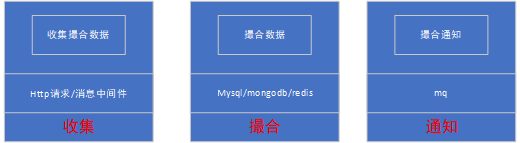

# 区块链撮合微服务系统

系统设计

性能分析

redis 大于 mongodb  大于 mysql  本系统使用mysql作为撮合存储
为了追求速度，对数据一至性问题，项目目前没有考虑
但为了保证数据事务完整性最好使用mongodb 4.0
有人说 redis 性能好，但redis 并不支持事务（只是做了一个命令打包的方式来运行）

数据库设计图

业务接口

-支持 发布撮合信息

-取消 撮合信息发布
